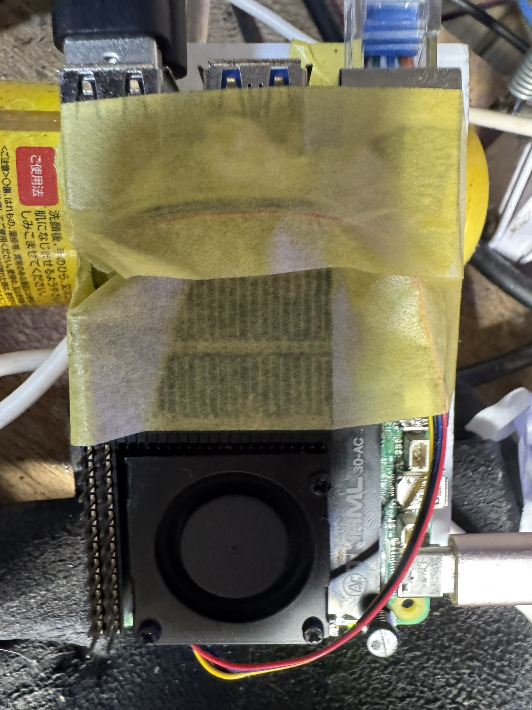
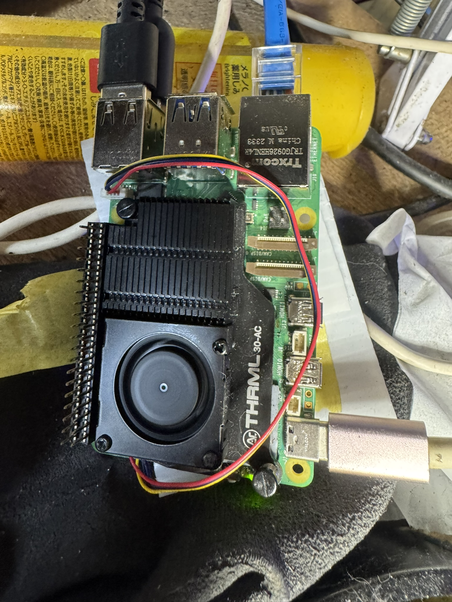

# OND800環境起因カオス測量 — 高畠アメダスと単体変数計画

状態: `[ACTIVE]` `[Layer A]` `[LIMITED]` `[MAD-PRACTICAL-SCIENCE]` `[POWER-UNSTABLE]`  
作成日: 2026-07-20  
対象: OND800 Pi 5の外気条件、機体温度、放熱配置、電源経路、USB負荷  
目的: HATパージ後も再発した低電圧について、環境起因、ガムテ位置、電源供給、USB負荷を一変数ずつ切り離す  
除外範囲: 室内実測温湿度、DC 5V rail、各USB機器電流、正確な局所風量。現時点では未取得

## [FACT] 過去ノートから拾えるOND800の熱・電力baseline

| 日付 | 構成 | Pi温度 | 電力状態 | 原典 |
|---|---|---:|---|---|
| 2026-06-15 | C922、NDI送出、OBS未接続 | 50.7°C | 本ノートにはthrottle値なし | `2026-06-15_load-test-orchestrator.md` |
| 2026-06-15 | C922、1080p30 NDI、Wi-Fi | 51.8°C | drops 0 | `2026-06-15_season1-complete.md` |
| 2026-06-18 | C922 + C960、1080p30 NDI×2、OBS受信、HyperPixel表示、Wi-Fi | 64.8〜67.0°C | `0x50000`履歴あり、観測時のcurrent bitsは0、drops 0 | `2026-06-18_obs-2source-load-test.md` |
| 2026-07-20 18時台 | pipeline停止、破損HAT接続 | 52.7°C | 低電圧反復 | `2026-07-20_post-breakage-electrical-survey.md` |
| 2026-07-20 20:47 | HATパージ、NDI×2、Ethernet | 65.3°C | 20:06〜20:45に低電圧10回 | 同上 |

過去の2カメラ全負荷で65〜67°C、今回の2カメラ全負荷で65.3°Cだった。Piコア温度だけを見る限り、今回は過去の動作実績帯域内である。ただし過去ノートの`0x50000`を「起動時の瞬間的なもの」とした根拠時刻は保存されておらず、現在の周期的低電圧と同型でなかったかは再評価対象である。

## [FACT] 同一高畠アメダスから取得した外気proxy

観測所は気象庁の高畠アメダス、現行観測所番号`35511`、過去データblock `1132`を使用する。地点は北緯38度0.2分、東経140度12.4分、標高220m。過去日と当日を同じ観測所系列へ固定し、品質flag `0`の値を採用した。

過去実験ノートに計測時刻がないため、過去行はGit commit時刻に最も近い正時をproxyとしている。commit時刻は測定時刻そのものではない。

| 日時 JST | 高畠アメダス気温 | 湿度 | 風速 | OND記録との接続 |
|---|---:|---:|---:|---|
| 2026-06-15 17:00 | 22.7°C | 54% | 2.7m/s | 負荷ノートcommit 17:22。Pi 50.7°Cの測定時刻は不明 |
| 2026-06-18 09:00 | 23.0°C | 63% | 3.7m/s | 2カメラ負荷ノートcommit 09:12。Pi 64.8〜67.0°C |
| 2026-06-26 17:00 | 23.3°C | 83% | 0.3m/s | 破損ログcommit 17:58。熱負荷試験ではない |
| 2026-07-20 18:20 | 31.1°C | 61% | 3.0m/s | 低電圧診断時間帯。Pi 52.7°Cはpipeline停止 |
| 2026-07-20 20:40 | 26.7°C | 84% | 1.3m/s | Pi 65.3°Cを20:47に測定、NDI×2 |

2026-07-20の日最高気温は、当日アメダス速報JSON上で35.2°Cだった。

日別値では、2026-06-15は平均20.0°C／最高25.1°C／最低13.7°C、2026-06-18は平均22.0°C／最高27.1°C／最低17.8°Cだった。Pi温度から時刻proxyのアメダス気温を引いた粗い差は、6月15日が約28.0°C、6月18日が約41.8〜44.0°C、7月20日が約38.6°Cである。室温差ではないため、thermal resistanceの実測値として扱わない。

出典:

- 気象庁「高畠（山形県）2026年6月 日ごとの値」  
  `https://www.data.jma.go.jp/stats/etrn/view/daily_a1.php?prec_no=35&block_no=1132&year=2026&month=6&day=&view=`
- 気象庁「高畠（山形県）1時間ごとの値」2026-06-15／18／26  
  `https://www.data.jma.go.jp/stats/etrn/view/hourly_a1.php?prec_no=35&block_no=1132&year=2026&month=6&day=15&view=`  
  `https://www.data.jma.go.jp/stats/etrn/view/hourly_a1.php?prec_no=35&block_no=1132&year=2026&month=6&day=18&view=`  
  `https://www.data.jma.go.jp/stats/etrn/view/hourly_a1.php?prec_no=35&block_no=1132&year=2026&month=6&day=26&view=`
- 気象庁アメダス速報JSON、高畠`35511`、2026-07-20  
  `https://www.jma.go.jp/bosai/amedas/data/point/35511/20260720_18.json`

## [INTERPRETATION] 暑さの現在位置

- 今日は過去の実験proxy時刻より外気が約3.7〜8.1°C高かった。環境起因の電源余裕低下、電源アダプタのderating、ケーブル／接点抵抗、筐体内温度上昇は寄与候補に上げる。
- 今回のPiコア65.3°Cは過去2カメラ実績65〜67°Cと同帯域であり、CPU熱スロットリングを支配原因とする証拠は弱い。
- アメダスは屋外の観測所値であり、二井宿の古民家室内、Pi吸気点、ACアダプタ表面温度を直接測った値ではない。外気proxyを室温factへ昇格しない。
- 気温だけで低電圧を説明しない。高温は電源、ケーブル、接点、USB負荷、ガムテによる流路拘束と同時に作用する一候補である。

## [FACT: PHOTO EVIDENCE] ガムテ配置

2026-07-20、同一iPhone 15 Pro MaxでA／B構成を撮影した。画像内の時刻表示ではなくJPEGのcreation metadataを用いる。

### A: ガムテあり



- creation: `2026-07-20 20:57:48`
- A短時間baselineの20:57:29〜20:57:59と重なる
- ガムテがヒートシンクのフィン上面を広く覆う。ファン円形開口は露出しているが、フィンから周囲へ抜ける流路を拘束しうる
- ガムテは冷却部品だけでなく基板上面を横断し、機体固定も兼ねているように見える

### B: ガムテ除去後



- creation: `2026-07-20 21:25:14`
- ヒートシンク全体とフィン間流路が露出した
- USB-C、Ethernet、USB機器は同じportへ接続されているように見える。ただし写真だけでは、ガムテ除去時の接触荷重や機体位置が完全不変だったとは証明できない
- 画像はいずれも1536×2048、Display P3、撮影機器はApple iPhone 15 Pro Max、software 26.5.2

写真で上面は比較できるようになったが、下面、側面、ファンの実風向、吸気側の空隙、電源コネクタ荷重はまだUNKNOWNである。

### [FACT / IDENTIFICATION-LIMITED] 冷却器

写真上の刻印は`THRML 30-AC`で、外形はArgon THRML 30-ACと整合する。購入記録または箱との照合は未実施なので、写真同定の射程に留める。

[GeekwormのArgon THRML 30-AC資料](https://wiki.geekworm.com/Argon_THRML_30-AC)は、アルミニウム9.6mm heatsink、4-pin 3007 PWM blower、5V、tachometer、最大1.09 CFM、最大8000 RPM ±15%と記載する。

1.09 CFMは約0.000514 m³/s、約0.514 L/sである。ただしこれは最大公称値で、ガムテ、フィン、周囲物、case圧力損失を含む実装流量ではない。科学測定では公称値を`V̇`へ代入せず、実流量またはtachometerとfan curveを取得する。

## [EXPERIMENT PLAN] 非侵襲から一変数ずつ切る

### 共通固定条件

- HyperPixel HATは再装着しない
- Ethernet、NDI受信側、解像度、fps、streamer commitを固定する
- 各窓のboot ID、開始／終了時刻、Pi温度、camera frames／dropsを残す
- `get_throttled`は履歴bitが粘るため、各窓で新規に増えたkernel低電圧logの件数と時刻を主指標にする
- 室温計があればPi吸気点付近を測る。なければアメダス値をproxyと明記する

### T0: 現状baseline、10〜15分

何も動かさず、低電圧event間隔、Pi温度、NDI dropsを採取する。

#### [FACT: RESULT] T0無変更窓

観測窓: 2026-07-20 20:57:10〜21:06:10 JST

構成: HATパージ、C922 + C960、NDI×2、Ethernet、streamer active。遠隔から構成変更なし。物理側には現状維持を依頼した。

- 1分ごとのPi温度は、65.3、65.3、65.3、65.3、67.0、66.4、65.3、64.2、63.7、65.9°Cだった。
- 最低63.7°C、最高67.0°C、10点平均65.37°Cだった。
- kernelは21:01:10と21:03:11に`Undervoltage detected!`を記録し、各2秒後に`Voltage normalised`へ戻った。
- 観測窓内の独立した低電圧eventは2件だった。1分窓のcountはevent境界が重複するため、最終判定はkernelの正確な時刻列を使用した。
- C922は20:57の83,100 framesから21:06の98,100 frames、C960は82,800 framesから99,300 framesまで進み、両方とも`drops=0`、`connections=1`を維持した。
- 終了時の`get_throttled`は履歴`0x50000`だった。

T0により、ガムテ、電源、USB構成を意図的に変更しない窓でも周期的低電圧が再現した。一方、Pi温度は過去2カメラ実績帯域に留まり、温度が単調上昇して一定閾値を越えた形でもなかった。CPUコア熱単独を支配原因とする説明は弱い。ガムテの流路、AC/DC供給、ケーブル／接点、USB負荷、室内局所温度は引き続き分離対象とする。

#### [FACT: T0 SHORT BASELINE] 2026-07-20 20:57

構成はHATパージ、ガムテ現状、C922＋C960、1080p30 NDI 2接続、Ethernet、display branch継続。

- 20:57:29〜20:57:59、10秒刻み4点のCPU温度は64.8、63.7、65.3、65.3°Cだった。
- 1秒`mpstat`のCPU idleは48.44、47.91、42.46、33.16%だった。
- `get_throttled`は全点で履歴`0x50000`だった。
- kernel低電圧eventは全点で11件のまま増えず、40秒窓では新規発生しなかった。直近は20:47:02、正常化は20:47:04だった。
- 20:58前後、C922は84,900 frames、C960は84,300 framesまで進み、両方ともdrops 0、connections 1だった。

これは短時間のA基準であり、低電圧が止まったことを意味しない。BとA'も同じ観測長へそろえる。温度比較の主指標は、現場室温取得後の`Pi CPU温度 - 現場室温`とする。

### T1: ガムテ位置だけ変更、15分

写真を残した後、放熱またはケーブル荷重に関与しそうなガムテだけを退避する。USB、電源、Pi本体を動かさない。ガムテが構造保持を担い、剥離で短絡・落下・コネクタ抜けが起きうる場合は実施しない。

低電圧event頻度と温度勾配が改善した場合は`関与濃厚`へ上げる。安全に元へ戻せる場合だけA/B/Aを行い、時間経過や外気低下だけによる改善を識別する。危険な再現のために悪い配置へ戻さない。

主要指標:

```text
thermal delta = Pi CPU温度 - 現場室温
temperature slope = warm-up開始後の°C/min
undervoltage rate = kernel低電圧event数 / 測定分
stream health = drops / frames、connections
```

判定は次のように分ける。

- `A → B`でthermal deltaと温度勾配が改善し、`B → A'`で悪化方向へ戻れば、ガムテairflow関与を`濃厚`へ上げる。
- 温度だけ変わり低電圧頻度が変わらなければ、airflowの熱寄与と電源問題を分離する。
- 低電圧頻度だけ変わり温度が変わらなければ、ガムテ移動に伴う接触・ケーブル荷重・電源経路変化を疑い、airflowへ帰属させない。
- どちらも変わらなければガムテ候補を下げ、電源／ケーブル単体変数へ移る。

#### [FACT: EARLY B] ガムテ除去直後

観測窓: 2026-07-20 21:28:43〜21:29:35 JST
写真上のB構成成立: 21:25:14

- 10秒刻み4点のCPU温度は63.7、63.7、63.1、63.7°C、平均63.55°Cだった。
- A短時間4点平均64.78°Cとの差は約−1.23°Cだった。
- BのCPU idle平均は約36.8%、Aは約43.0%で、Bの方がCPU負荷はやや高かった。
- C922は138,000 frames、C960は141,000 framesまで進み、両方ともdrops 0、connections 1だった。
- 低電圧は21:25:22〜24と21:27:23〜25にも発生した。ガムテ除去による低電圧の即時停止効果はなかった。

約1.2°Cの初期差は、A内の瞬時変動幅、現場吸気温未測定、アメダス外気との乖離、時刻drift、CPU workload差、fan PWM／hysteresisに埋もれうる。科学的効果量としては未検出で、`airflow関与疑い／ノイズと識別不能`を維持する。15分後のB窓、現場吸気温、流量、反復が揃うまで改善とは呼ばない。低電圧はairflowと別系列として電源／ケーブル試験へ残す。

#### [FACT: B AFTER 15 MINUTES] ガムテ除去15分後

観測窓: 2026-07-20 21:40:29〜21:40:59 JST

- 10秒刻み4点のCPU温度は64.2、63.7、63.7、63.1°C、平均63.675°Cだった。
- CPU idleは41.93、42.71、40.55、41.86%、平均約41.76%だった。A短時間平均約43.0%と近いが、同一命令列、同一消費電力を保証する値ではない。
- cooling deviceは`pwm-fan`、`cur_state=2`、`max_state=4`だった。hwmonは`fan1_input=5455` RPM、`pwm1=125`、`pwm1_enable=1`を示した。
- C922は約157,800 frames、C960は約162,000 framesまで進み、両方ともdrops 0、connections 1だった。
- B写真の21:25:14以後も、21:25:22、21:27:23、21:31:24、21:33:25に低電圧を記録し、各eventは約2秒後に正常化した。ガムテ除去後も低電圧は4件発生した。
- 観測時の`get_throttled`は履歴`0x50000`、低電圧event累計は24件だった。

A短時間平均64.78°Cとの差は約−1.10 Kである。しかし、高畠アメダスproxyも21:00の26.6°Cから21:30の26.1°Cへ約−0.5 K動いた。屋外proxyで粗く差し引いても見かけ差は約−0.6 Kに縮み、現場吸気温、湿度、局所微風、熱だまり、Pi実消費電力、fan制御、配置変化の不確かさより十分大きいとは示せない。

したがって、この現場試験の判定は`airflow関与疑い／効果量未検出／ノイズと識別不能`とする。約4%に見える熱抵抗差を改善率として採用しない。現在の負荷範囲ではガムテ仮固定が冷却を決定的に壊した証拠はなく、実用上は「ガムテも意外に強かった」側へ更新する。低電圧はガムテ除去で止まらなかったため、既知の5V/3A受電envelope、USB-Cケーブル／接点、USB負荷の枝へ分離する。

#### [MEASUREMENT RULER] 4%差を判定する条件

ZeroRoomLabの今回の判定定規では、4%級の差を機体airflowの効果として主張するには、少なくとも次のfixture管理を要求する。これは一般規格の引用ではなく、本実験で偽の改善率を作らないために採用した局所条件である。

- 温度を±0.1°C以内で固定または追跡補正する
- 相対湿度を±0.5 percentage point以内で固定または追跡補正する
- 大気循環を無視できる静穏状態にするか、微風の方向と流量を管理して同一化する
- fan RPM／PWM、Pi入力電力、命令負荷、ケーブル配置、測定probe位置を固定する
- A/B/Aまたは複数反復を行い、測定器精度、時系列drift、個体差を含むuncertainty budgetを出す

この条件を満たさない古民家ベンチでは、今回の約4%相当は誤差として扱う。アメダスと実吸気温は乖離しうるため、数°Cの差であっても自動的に有益な差へ昇格しない。現場工学に使えるのは、複数の未管理変数を越えてなお残る大きく頑健なeffectであり、percent級の寄与分離はチャンバーまたは同等fixtureへ送る。

### [PRACTICAL-SCIENCE MODEL] Δ何K、流量、熱輸送

温度一点ではなく、次の測定modelへ進む。

#### 1. coreと吸気の温度差

```math
\Delta T_{core-in}=T_{core}-T_{inlet}
```

単位はK。温度差では1 K = 1°Cである。`T_inlet`はアメダス外気ではなく、ファン吸気点近傍の現場実測を正とする。

現時点のアメダスproxyでは、A短時間平均64.78°Cと21:00外気26.6°CからAは約38.18 K、B 15分後平均63.675°Cと直近取得済み21:30外気26.1°CからBは約37.58 Kとなる。見かけ差は約−0.60 Kで改善方向だが、室温、湿度、微風、測定時刻、局所熱だまりが異なるため正式なthermal deltaではない。

#### 2. 空気が運んだ熱量

```math
\dot m=\rho\dot V=\rho A\bar v
```

```math
\dot Q_{air}=\dot m c_p(T_{outlet}-T_{inlet})
=\rho\dot Vc_p\Delta T_{air}
```

- `ρ`: 測定時空気密度 kg/m³
- `A`: 測定duct断面積 m²
- `v̄`: 断面平均風速 m/s
- `V̇`: 体積流量 m³/s
- `c_p`: 空気の定圧比熱 J/(kg·K)
- `T_outlet - T_inlet`: 冷却器を通過した空気の温度上昇 K

ファンの公称free-air流量は、ガムテ、フィン、ケース、ケーブルによる圧力損失を含まない。実装状態では、既知断面の簡易duct／flow hoodと風速計で`V̇`を測る。

#### 3. 実効熱抵抗

```math
R_{\theta,eff}=\frac{T_{core}-T_{inlet}}{P_{diss}}
\quad [K/W]
```

同一`P_diss`、同一局所吸気温、同一fan状態と仮定した場合に限り、現場proxyは次の比に見える。

```math
\frac{R_{\theta,B}}{R_{\theta,A}}
\approx\frac{37.58}{38.18}\approx0.984
```

数値上は約0.984になるが、Pi入力電力、SoC実消費、局所吸気温が未測定で、fan回転数もBの一点しかないため、仮定を満たした証拠がない。したがって約1.6%であれ、補正前の約4%であれ、効果量主張には使わない。この計算は、必要な変数が欠けると同じ温度列から見かけのK/Wを作れてしまうことを示す反例である。

#### 4. 過渡状態では蓄熱も残す

```math
C_\theta\frac{dT_{core}}{dt}
=P_{diss}-\dot Q_{air}-\dot Q_{cond}-\dot Q_{rad}
```

空気だけでなく、基板、固定面、ケーブルへの熱伝導と放射も同時に発動する。steady stateへ達していない窓では、`dT/dt`を無視してCOPまたは熱抵抗を逆算しない。

#### 5. fan回転数nを固定または記録する

同じfan／相似条件の近似ではfan lawsを使う。

```math
\dot V\propto n
\qquad
\Delta p\propto n^2
\qquad
P_{fan}\propto n^3
```

ガムテ除去でcore温度が下がりfan制御段が変われば、流路と回転数の二変数になる。tachometerまたはOSのcooling stateを同時記録する。

#### 6. COPではなくair transport gainを分ける

fanは冷凍機やheat pumpではないため、`COP`をそのまま熱力学上の成績係数として扱わない。本実験では次の局所指標を使う。

```math
G_{air}=\frac{\dot Q_{air}}{P_{fan}}
```

これは`空気へ移した熱量 / fan電力`のCOP-likeなair transport gainである。Pi全体効率とは別物で、`P_fan=V_fan I_fan`も実測する。case設計比較では、`Rθ,eff`、`V̇`、`G_air`、騒音、connector荷重を同時に評価する。

#### 必要な最小測定器

1. ファン吸気点と排気点の温度probe 2本
2. 現場室温probe 1本
3. 既知断面ductと低風速対応anemometer
4. USB-C inline power meterまたはDC電力計
5. fan電圧／電流と、可能ならtachometer
6. Pi log、NDI frames／drops、低電圧eventを同一時計へ同期するlogger

この測定で、ケース費用は外装費ではなく、流量、熱抵抗、fan電力、strain reliefを再現可能な境界へ固定するR&D治具費として説明できる。

### [DECISION BRANCH] 差が立たない場合も結果である

反復後も`ΔT`、`V̇`、`Rθ,eff`、低電圧event率に意味のある差が立たない場合、`ガムテは見た目が雑だからairflowも悪いはず`という仮説を維持しない。

- ガムテairflow関与を下げる
- 現在の冷却器と負荷範囲では、ガムテ仮固定が意外に強かったと記録する
- 低電圧の支配候補を既知の5V/3A受電envelope、USB-Cケーブル、接点、USB負荷へ移す
- ケースの目的を冷却救済だけにせず、配置再現性、strain relief、基板保護、交換性、持ち運びへ置く

この枝のマーケティング候補は次になる。

> ガムテでも動いた。だから捨てない。
> 古民家ベンチで生き残ったガムテ砲の流路と固定を、持ち運べるケースへ昇格させる。

逆に差が立った場合は、ケースを定義済みairflowのための熱設計部品として説明する。どちらの結果でも、実測前からケースの物語へデータを従わせない。

### T2: 過去PD試験の再構成 — 追加の高W USB PD交換は停止

操作者報告ではGaN 140W USB PDアダプタを過去に検証済みだが、OND800 Pi 5の受電は5V modeに留まり、高電圧PD modeを利用できなかった。現在は5V/3Aで最低配信を維持する縮退運用である。元実験日時と生logがrepositoryから抜けているため、`2026-07-20_pi5-power-delivery-constraint-reconstruction.md`へ`[SOURCE-GAP]`付きで再構成した。

この既知結果により、汎用高W PDアダプタをさらに横滑り交換する試験は停止する。5V source sagの切り分けだけなら手元の実験用安定化電源で10A級の供給能力を用意できるが、供給電流の余裕だけを増やしても配備価値は薄い。鰐口clip／jumper、露出knob、猫の接触を含むassemblyは実務耐性を下げるため、安全fixtureと有人監視を成立させたbench対照に限る。次の本命は配線統合を得るPoE HAT、または瞬断・停電bufferを得るbattery HAT等へ電力経路を変更する枝であり、部材入手までresource-gatedとする。

### T3: USBカメラ負荷を2→1→0台

現行5V/3A電源とガムテ配置を固定し、各15分でC922 + C960、C922のみ、C960のみ、0台を比較する。目的はUSB-Cを完成解にすることではなく、投げ銭待ちの縮退期間にどこまで安全に配信できるかを測ることにある。hotplug callback修正済みだが、USB抜き差しで電源コネクタやPi本体を動かさない。

### T4: 外気／室温の時間差

上記で低電圧が消えない場合、同じ構成を気温の下がる時間帯に再測定する。時刻と負荷を記録し、温度依存のevent率を見る。昼夜比較はグリッド需要や宅内負荷も同時に変わるため、単独変数確定ではなく環境系列の絞り込みとする。

## [MAD PRACTICAL SCIENCE]

この実験は「液晶が犯人だった」という物語を守るためではない。HAT黒という工学的隔離を維持したまま、低電圧という残差の支配法則を探す。

予測と逆のeffect、周期性、設定消失、layer間連動は、都合の悪いノイズとして消さない。既知モデルで説明できる枝を先に測り、それでも残る差分だけを未知のlogicまたは追加抽象機械の候補へ送る。

## [INNER] 内観メモ

高畠の夏は、実験室の恒温槽ではない。
古民家の空気、壁のコンセント、熱を抱くACアダプタ、曲がったケーブル、二台のカメラ、ガムテ一枚まで、全部が同時に鳴る。

だから一枚ずつ剥がす。ただし、飛べるようになった機体を証明の生贄にはしない。

## Provenance

- 外気系列の切り分け、ガムテ位置仮説、単体変数化の指示: fusamofu / Mitsuru Saitō
- OND800過去ノート、Git commit時刻、実機logの照合: OpenAI Codex
- 気象データ: 気象庁 高畠アメダス`35511`
- A／B物理変更と写真撮影: fusamofu / Mitsuru Saitō
- JPEG metadata抽出、配置読解、A／B実機log照合: OpenAI Codex
- 同日generation: `2026-07-20_amedas-airflow-single-variable-survey.md`のA/B/A判定式とT0実測を本Noteへ統合。統合前generationはcommit `0f1a9f8`に保持する。
